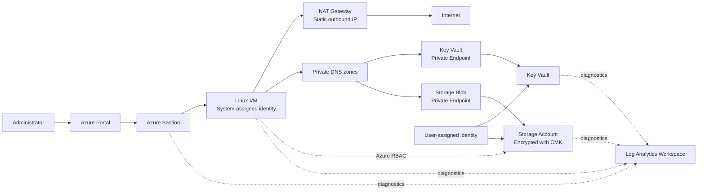
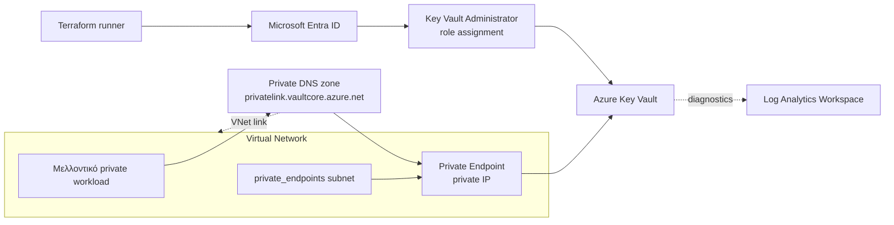

# Θεωρητικό υπόβαθρο του AVM Terraform Lab

Αυτό το κείμενο εξηγεί τις έννοιες που χρειάζεται κάποιος για να καταλάβει την
υποδομή του lab και όχι μόνο για να εκτελέσει τις εντολές. Το πρακτικό
walkthrough βρίσκεται στο [README.md](./README.md), ενώ εδώ αναλύονται το
Terraform, το Azure networking, η ταυτότητα, η ασφάλεια, η παρακολούθηση και η
τελική αρχιτεκτονική.

## 1. Τι προσπαθεί να διδάξει το lab

Το lab κατασκευάζει σταδιακά ένα μικρό αλλά αρκετά ρεαλιστικό Azure environment:

1. Resource Group και Log Analytics Workspace.
2. Virtual Network, subnets, Network Security Group και NAT Gateway.
3. Key Vault, Private Endpoint και Private DNS.
4. Storage Account, customer-managed encryption key και Managed Identity.
5. Linux Virtual Machine και Azure Bastion.
6. Σύνδεση στη VM χωρίς public IP.
7. Authentication της VM με Managed Identity.
8. Πρόσβαση σε private Blob Storage χωρίς αποθηκευμένο password ή access key.

Η βασική εκπαιδευτική ιδέα είναι ότι η υποδομή εξελίσσεται χωρίς να πετάμε το
προηγούμενο Terraform state. Κάθε part προσθέτει configuration στο ίδιο root
module και το Terraform υπολογίζει τη διαφορά από την ήδη υπάρχουσα υποδομή.

## 2. Η τελική αρχιτεκτονική με μία ματιά



Η VM δεν χρειάζεται public IP. Ο administrator εισέρχεται μέσω Bastion, η VM
βγαίνει προς το Internet μέσω NAT Gateway και προσεγγίζει Key Vault και Storage
μέσω private endpoints. Οι ταυτότητες και το Azure RBAC αντικαθιστούν τα
hard-coded credentials.

### 2.1 Αναλυτικό διάγραμμα όλων των resources

Το παρακάτω διάγραμμα δείχνει τα Azure resources που προσθέτουν τα Parts 1–5, καθώς
και τις συνδέσεις δικτύου, DNS, identity, RBAC, encryption και monitoring μεταξύ τους.

```mermaid
flowchart TB
    ADMIN[Administrator]
    PORTAL[Azure Portal]
    INTERNET[Internet]
    ENTRA[Microsoft Entra ID]

    subgraph SUB[Azure Subscription]
        EAH[EncryptionAtHost feature registration<br/>subscription scope and optional]

        subgraph RG[Resource Group: rg-demo-dev-italynorth-001]
            LAW[Log Analytics Workspace]

            subgraph NETWORK[Network layer]
                VNET[VNet: vnet-demo-dev-italynorth-001<br/>10.0.0.0/22]
                VMSUB[virtual_machines subnet<br/>10.0.0.0/24]
                BASSUB[AzureBastionSubnet<br/>10.0.1.0/26]
                PESUB[private_endpoints subnet<br/>10.0.1.64/28]
                NSG[Network Security Group<br/>deny outbound to Internet]
                NATPIP[NAT Public IP<br/>static]
                NAT[NAT Gateway]
                BASPIP[Bastion Public IP<br/>static]

                VNET --> VMSUB
                VNET --> BASSUB
                VNET --> PESUB
                NSG -. subnet association .-> PESUB
                NATPIP --> NAT
                VMSUB -. subnet association .-> NAT
            end

            subgraph COMPUTE[Compute and secure administration]
                NIC[Network Interface<br/>private IP only]
                VM[Linux Virtual Machine]
                VMID[VM system-assigned<br/>managed identity]
                BASTION[Azure Bastion Standard]

                NIC --> VM
                VM --> VMID
            end

            subgraph SECRETS[Secrets and encryption]
                KV[Azure Key Vault<br/>RBAC plus firewall]
                CMK[RSA key<br/>cmk-for-storage-account]
                SSHSECRET[Generated SSH private key<br/>stored as Key Vault secret]
                KVPE[Key Vault Private Endpoint<br/>subresource: vault]
                KVDNS[Private DNS Zone<br/>privatelink.vaultcore.azure.net]
                UAMI[User-assigned Managed Identity]

                KV --> CMK
                KV --> SSHSECRET
            end

            subgraph DATA[Private data layer]
                STORAGE[Storage Account<br/>LRS plus infrastructure encryption]
                STORAGEID[Storage system-assigned identity]
                BLOB[Blob service]
                CONTAINER[Private container: demo]
                STORAGEPE[Storage Private Endpoint<br/>subresource: blob]
                STORAGEDNS[Private DNS Zone<br/>privatelink.blob.core.windows.net]

                STORAGE --> STORAGEID
                STORAGE --> BLOB --> CONTAINER
            end

            DIAG[Azure Monitor Diagnostic Settings<br/>one setting on each supported resource]
        end

        subgraph NWGROUP[NetworkWatcherRG - created and managed by Azure]
            NW[Network Watcher: italynorth]
        end
    end

    subgraph TFONLY[Terraform state or AVM telemetry - not workload resources in the Resource Group]
        RAND[random_string.unique_name]
        UUID[random_uuid per telemetry-enabled AVM module]
        MODTM[modtm_telemetry per AVM module]
        TFSTATE[Terraform state]

        TFSTATE --> RAND
        TFSTATE --> UUID --> MODTM
    end

    ADMIN --> PORTAL --> BASPIP --> BASTION
    BASTION -. attached to .-> BASSUB
    BASTION -->|SSH over private IP| NIC
    NIC -. attached to .-> VMSUB
    VM -->|outbound traffic| NAT --> INTERNET
    NSG -. blocks direct Internet egress .-> INTERNET

    KVPE -. attached to .-> PESUB
    STORAGEPE -. attached to .-> PESUB
    KVPE -->|Private Link| KV
    STORAGEPE -->|Private Link| BLOB
    KVDNS -. VNet link and private record .-> VNET
    STORAGEDNS -. VNet link and private record .-> VNET
    KVDNS -. resolves vault name to .-> KVPE
    STORAGEDNS -. resolves blob name to .-> STORAGEPE
    VM -->|private DNS lookup| KVDNS
    VM -->|private DNS lookup| STORAGEDNS

    ENTRA --> VMID
    ENTRA --> UAMI
    ENTRA -. deployment identity .-> ADMIN
    ADMIN -. Key Vault Administrator .-> KV
    UAMI -. attached encryption identity .-> STORAGE
    UAMI -. Key Vault Crypto Service Encryption User .-> KV
    CMK -->|customer-managed encryption key| STORAGE
    VMID -. Storage Blob Data Contributor .-> CONTAINER
    VM -->|Entra token and HTTPS| CONTAINER
    ADMIN -. retrieves the generated credential when needed .-> SSHSECRET
    EAH -. enables host encryption capability .-> VM

    VNET -. diagnostics .-> DIAG
    NSG -. diagnostics .-> DIAG
    KV -. diagnostics .-> DIAG
    STORAGE -. diagnostics .-> DIAG
    BLOB -. diagnostics .-> DIAG
    VM -. diagnostics .-> DIAG
    BASTION -. diagnostics .-> DIAG
    BASPIP -. diagnostics .-> DIAG
    DIAG --> LAW
    NW -. observes the regional virtual network .-> VNET

    RAND -. unique suffix for globally unique names .-> KV
    RAND -. unique suffix for globally unique names .-> STORAGE
```



Πώς διαβάζεται το διάγραμμα:

- Οι συνεχείς γραμμές δείχνουν κυρίως ροή traffic, δεδομένων ή εξάρτηση encryption.
- Οι διακεκομμένες γραμμές δείχνουν associations, DNS, RBAC, identity ή diagnostics.
- Η τοποθέτηση ενός resource δίπλα σε ένα subnet δηλώνει network attachment, όχι ότι το subnet
  είναι ARM parent του resource.
- Το `NetworkWatcherRG` δημιουργείται αυτόματα από το Azure και δεν ανήκει στο main Resource Group
  του lab.
- Τα `random_string`, `random_uuid` και `modtm_telemetry` εμφανίζονται στο Terraform state, αλλά δεν είναι
  Azure workload resources όπως μία VM ή ένα VNet.

## 3. Azure hierarchy: πού ανήκει κάθε πόρος

Για να καταλάβουμε τα resource IDs και τα permissions, χρειαζόμαστε την Azure
ιεραρχία:

```text
Microsoft Entra tenant
└── Subscription
    └── Resource Group
        ├── Virtual Network
        ├── Log Analytics Workspace
        ├── Key Vault
        ├── Storage Account
        └── Virtual Machine
```

### Tenant

Ο Microsoft Entra tenant είναι ο χώρος ταυτοτήτων. Περιέχει users, groups,
service principals και managed identities.

### Subscription

Η subscription είναι όριο billing, quotas, Azure Policies και RBAC scope. Στο
lab χρησιμοποιείται η ενεργή `Azure for Students` subscription. Η subscription
μπορεί να επιβάλλει policy που περιορίζει τα επιτρεπόμενα regions, όπως είδαμε
όταν το `germanywestcentral` απορρίφθηκε για το Log Analytics Workspace.

### Resource Group

Το Resource Group είναι λογικό container για πόρους που συνήθως έχουν κοινό
lifecycle. Δεν είναι δίκτυο και δεν απομονώνει traffic. Μας επιτρέπει να
οργανώνουμε, να εξουσιοδοτούμε, να παρακολουθούμε και να διαγράφουμε μαζί τους
πόρους ενός workload.

### Region

Το region είναι η γεωγραφική περιοχή όπου λειτουργεί ένας πόρος. Η επιλογή
επηρεάζει availability, latency, policy, compliance, SKU availability και
κόστος. Το lab χρησιμοποιεί `italynorth` επειδή επιτρέπεται από την ενεργή
subscription policy και υποστηρίζει τους βασικούς πόρους της αρχιτεκτονικής.

## 4. Infrastructure as Code

Infrastructure as Code — IaC — σημαίνει ότι περιγράφουμε την επιθυμητή υποδομή
σε version-controlled αρχεία αντί να δημιουργούμε κάθε πόρο χειροκίνητα στο
Portal.

Τα βασικά πλεονεκτήματα είναι:

- επαναληψιμότητα,
- review πριν από αλλαγές,
- ιστορικό μέσω Git,
- ίδια λογική για dev, test και production,
- μικρότερη πιθανότητα χειροκίνητης απόκλισης,
- αυτοματοποίηση μέσω CI/CD,
- δυνατότητα ελεγχόμενου cleanup.

Το IaC δεν κάνει αυτόματα μια αρχιτεκτονική ασφαλή. Ένα λανθασμένο network rule
ή ένα υπερβολικό RBAC role παραμένει λανθασμένο ακόμη και αν γράφτηκε σε
Terraform. Το όφελος είναι ότι γίνεται ορατό, επαναλήψιμο και ελέγξιμο.

## 5. Declarative μοντέλο του Terraform

Το Terraform είναι declarative. Περιγράφουμε το επιθυμητό τελικό αποτέλεσμα:

```hcl
module "resource_group" {
  source  = "Azure/avm-res-resources-resourcegroup/azurerm"
  version = "0.2.1"

  name     = local.resource_names.resource_group_name
  location = var.location
  tags     = var.tags
}
```

Δεν γράφουμε βήματα τύπου:

```text
1. Κάλεσε αυτό το API.
2. Περίμενε 10 δευτερόλεπτα.
3. Δημιούργησε το επόμενο αντικείμενο.
```

Το Terraform συγκρίνει configuration, state και πραγματικό Azure, κατασκευάζει
dependency graph και αποφασίζει τη σωστή σειρά ενεργειών. Η
[Terraform language](https://developer.hashicorp.com/terraform/language)
χρησιμοποιείται κυρίως για να δηλώνει resources και τις μεταξύ τους σχέσεις.

## 6. Root module, child modules και AVM

Όλα τα `.tf` αρχεία μέσα στο `avm-lab` αποτελούν μαζί το root module. Τα
filenames οργανώνουν τον κώδικα για τον άνθρωπο, αλλά δεν καθορίζουν σειρά
εκτέλεσης.

Ένα block όπως:

```hcl
module "virtual_network" {
  source  = "Azure/avm-res-network-virtualnetwork/azurerm"
  version = "0.14.1"
}
```

καλεί child module από το Terraform Registry.

Τα Azure Verified Modules — AVM — είναι modules που ακολουθούν κοινά Azure
standards για interfaces, diagnostics, RBAC, locks, private endpoints, tags και
άλλες επαναλαμβανόμενες δυνατότητες. Δεν είναι ξεχωριστή υπηρεσία του Azure.
Είναι επαναχρησιμοποιήσιμο Terraform code.

Το `source` απαντά «από πού έρχεται το module». Το `version` απαντά «ποια έκδοση
του interface και της υλοποίησης χρησιμοποιούμε».

## 7. Providers

Provider είναι plugin που επιτρέπει στο Terraform να επικοινωνεί με ένα API.
Στο lab συναντάμε:

| Provider | Ρόλος |
|---|---|
| `azurerm` | Διαχείριση Azure Resource Manager resources |
| `azapi` | Πρόσβαση σε Azure REST resource types και νεότερα API features |
| `random` | Σταθερές τυχαίες τιμές που αποθηκεύονται στο state |
| `http` | Ανάγνωση δεδομένων από HTTP endpoint |
| `modtm` | Προαιρετικό AVM module telemetry |

Το `terraform init` εγκαθιστά τους providers και τα modules. Δεν δημιουργεί
cloud resources.

Το `.terraform.lock.hcl` καταγράφει τις ακριβείς provider εκδόσεις και τα
checksums τους. Πρέπει συνήθως να γίνεται commit. Ο φάκελος `.terraform/`
περιέχει downloaded dependencies και δεν γίνεται commit.

## 8. Variables, tfvars, locals και outputs

### Input variables

Τα variables είναι το public interface του root module:

```hcl
variable "location" {
  type        = string
  description = "The Azure region where the resources will be created."
}
```

Το type αποτρέπει λανθασμένες κατηγορίες τιμών. Τα validation blocks απορρίπτουν
τιμές που δεν ικανοποιούν τους κανόνες μας πριν γίνει Azure API call.

### `terraform.tfvars`

Το `terraform.tfvars` δίνει environment-specific τιμές:

```hcl
location      = "italynorth"
address_space = "10.0.0.0/22"
```

Το Terraform φορτώνει αυτόματα το συγκεκριμένο filename. Το πραγματικό αρχείο
αγνοείται από το Git επειδή σε άλλα projects μπορεί να περιέχει ευαίσθητα
δεδομένα. Το `terraform.tfvars.example` λειτουργεί ως ασφαλές template.

### Locals

Τα locals είναι υπολογισμένες, εσωτερικές τιμές:

```hcl
sequence = format("%03d", var.resource_name_sequence_start)
```

Το `1` γίνεται `001`. Με το `templatestring` προκύπτουν συνεπή ονόματα:

```text
rg-demo-dev-italynorth-001
law-demo-dev-italynorth-001
vnet-demo-dev-italynorth-001
```

### Outputs

Τα outputs εκθέτουν χρήσιμες τιμές από το root module:

```hcl
output "resource_ids" {
  value = {
    resource_group = module.resource_group.resource_id
  }
}
```

Τα outputs δεν δημιουργούν resources. Διαβάζονται από το CLI, άλλα modules ή
automation pipelines.

## 9. HCL expressions που χρησιμοποιεί το lab

### `for` expression

```hcl
{
  for key, subnet in var.subnets : key => subnet.size
}
```

Διαβάζει κάθε subnet object και δημιουργεί νέο map `όνομα => prefix size`.

### Conditional expression

```hcl
subnet.has_nat_gateway ? {
  id = module.nat_gateway.resource_id
} : null
```

Αν η συνθήκη είναι true, δημιουργείται association με το NAT Gateway. Αν είναι
false, το `null` σημαίνει ότι η προαιρετική ιδιότητα παραλείπεται.

### Typed objects

```hcl
type = map(object({
  size                       = number
  has_nat_gateway            = bool
  has_network_security_group = bool
}))
```

Κάθε map entry πρέπει να ακολουθεί το ίδιο schema. Έτσι λάθη όπως
`has_nat_gateway = "yes"` απορρίπτονται επειδή αναμένεται boolean.

## 10. Dependency graph

Η αναφορά:

```hcl
resource_group_name = module.resource_group.name
```

δηλώνει ταυτόχρονα input και dependency. Το Terraform γνωρίζει ότι το Resource
Group πρέπει να υπάρχει πριν από τον εξαρτώμενο πόρο.

Παρόμοια:

```hcl
workspace_resource_id = module.log_analytics_workspace.resource_id
```

σημαίνει ότι το Workspace πρέπει να υπάρχει πριν δημιουργηθεί το diagnostic
setting.

Το explicit `depends_on` χρειάζεται μόνο όταν υπάρχει πραγματική dependency που
δεν εκφράζεται μέσα από κάποια τιμή. Η υπερβολική χρήση του κάνει τον γράφο πιο
σειριακό και τα plans λιγότερο ακριβή.

## 11. Plan, apply και idempotency

### Plan

```powershell
terraform plan -out=tfplan
```

Το plan υπολογίζει τη μετάβαση από την τρέχουσα κατάσταση στην επιθυμητή. Τα
σύμβολα συνήθως σημαίνουν:

| Σύμβολο | Ενέργεια |
|---|---|
| `+` | Create |
| `~` | Update in place |
| `-` | Destroy |
| `-/+` | Destroy και replacement |
| `<=` | Read data source |

Το `-out=tfplan` αποθηκεύει το συγκεκριμένο plan. Το `terraform apply tfplan`
εφαρμόζει ακριβώς αυτό που ελέγχθηκε.

### Apply

Το apply εκτελεί τις ενέργειες και ενημερώνει το state. Αν αποτύχει στη μέση,
δεν κάνει γενικό rollback. Ό,τι δημιουργήθηκε επιτυχώς παραμένει και γράφεται
στο state. Αυτό συνέβη όταν δημιουργήθηκε το πρώτο Resource Group αλλά το Log
Analytics Workspace απορρίφθηκε από region policy.

Μετά από partial apply πρέπει να δημιουργείται νέο plan. Το παλιό saved plan
βασίζεται σε προηγούμενο state και δεν πρέπει να επαναχρησιμοποιείται.

### Idempotency

Αν configuration, state και Azure συμφωνούν, νέο plan πρέπει να επιστρέφει:

```text
No changes. Your infrastructure matches the configuration.
```

Αυτό είναι βασική ιδιότητα του declarative IaC: η επανάληψη δεν πρέπει να
δημιουργεί διπλούς πόρους.

## 12. Terraform state

Το state είναι η αντιστοίχιση μεταξύ Terraform addresses και πραγματικών cloud
objects:

```text
module.resource_group.azurerm_resource_group.this
    ↕
/subscriptions/.../resourceGroups/rg-demo-dev-italynorth-001
```

Το Terraform το χρησιμοποιεί για mapping, dependency metadata, refresh και
υπολογισμό αλλαγών. Η HashiCorp συνιστά ασφαλές remote backend με locking για
ομαδική χρήση, αντί για commit του state στο Git. Δες το
[Terraform state](https://developer.hashicorp.com/terraform/language/state).

Στο εκπαιδευτικό lab το state είναι τοπικό:

```text
terraform.tfstate
terraform.tfstate.backup
```

Κανόνες:

- Δεν το κάνουμε commit.
- Δεν το επεξεργαζόμαστε χειροκίνητα.
- Δεν το διαγράφουμε ενώ υπάρχουν managed resources.
- Δεν μοιραζόμαστε το περιεχόμενό του δημόσια.
- Για αλλαγές χρησιμοποιούμε τις εντολές `terraform state`, όχι text editor.

## 13. Data sources και resources

Resource σημαίνει ότι το Terraform διαχειρίζεται lifecycle:

```text
create → read → update → delete
```

Data source σημαίνει ότι το Terraform διαβάζει υπάρχουσα πληροφορία χωρίς να
την κατέχει. Για παράδειγμα, το `azurerm_client_config` διαβάζει στοιχεία της
τρέχουσας Azure ταυτότητας.

Τα `random_uuid` και `modtm_telemetry` εμφανίζονται ως Terraform resources αλλά
δεν είναι workload Azure infrastructure. Τα UUIDs ζουν στο state και το ModTM
καταγράφει προαιρετικό AVM lifecycle telemetry.

## 14. Drift

Drift είναι η διαφορά που προκύπτει όταν κάποιος αλλάξει χειροκίνητα έναν πόρο
στο Portal ή μέσω CLI χωρίς να ενημερώσει το Terraform configuration.

Παράδειγμα:

1. Το Terraform ορίζει tag `env = "dev"`.
2. Κάποιος το αλλάζει στο Portal σε `env = "test"`.
3. Το επόμενο plan κάνει refresh.
4. Το Terraform προτείνει επαναφορά σε `env = "dev"`.

Για αυτό αποφεύγουμε τις χειροκίνητες διορθώσεις. Αλλάζουμε τον κώδικα, βλέπουμε
plan και μετά κάνουμε apply.

## 15. Public και private IP addresses

### Public IP

Μια public IP μπορεί να χρησιμοποιηθεί για επικοινωνία μέσω Internet. Δεν
σημαίνει από μόνη της ότι κάθε port είναι ανοιχτό· NSGs, firewalls και η ίδια η
υπηρεσία εξακολουθούν να ελέγχουν την πρόσβαση.

### Private IP

Private ranges όπως τα παρακάτω δεν δρομολογούνται στο public Internet:

```text
10.0.0.0/8
172.16.0.0/12
192.168.0.0/16
```

Το lab χρησιμοποιεί `10.0.0.0/22`, μέρος του RFC 1918 private range. Οι πόροι
μέσα στο VNet χρησιμοποιούν private IPs για εσωτερική επικοινωνία.

## 16. CIDR notation

Το CIDR γράφεται ως:

```text
IP address / prefix length
```

Για IPv4 υπάρχουν 32 bits. Στο `/22`, τα 22 bits ανήκουν στο network portion
και απομένουν 10 bits για addresses:

```text
2^(32 - 22) = 2^10 = 1.024 addresses
```

Το `10.0.0.0/22` καλύπτει:

```text
10.0.0.0 έως 10.0.3.255
```

Όσο μεγαλώνει το prefix, μικραίνει το subnet:

| CIDR | Συνολικές IPv4 addresses | Azure usable |
|---|---:|---:|
| `/22` | 1.024 | 1.019 |
| `/24` | 256 | 251 |
| `/26` | 64 | 59 |
| `/28` | 16 | 11 |

Το Azure δεσμεύει τις πρώτες τέσσερις και την τελευταία IP κάθε subnet. Αυτό
πρέπει να λαμβάνεται υπόψη στο sizing. Δες το
[Azure Virtual Network FAQ](https://learn.microsoft.com/en-us/azure/virtual-network/virtual-networks-faq).

## 17. Γιατί δεν επιτρέπεται CIDR overlap

Ο router επιλέγει προορισμό με βάση το destination IP και τους γνωστούς routes.
Αν δύο συνδεδεμένα δίκτυα έχουν ίδιο range, δεν μπορεί να ξεχωρίσει αξιόπιστα σε
ποιο από τα δύο βρίσκεται ο προορισμός.

Το overlap δημιουργεί προβλήματα σε:

- subnets του ίδιου VNet,
- VNet peering,
- site-to-site VPN,
- point-to-site VPN,
- ExpressRoute,
- σύνδεση Azure με άλλο cloud.

Γι' αυτό ένα enterprise IP plan δεσμεύει μοναδικά ranges πριν δημιουργηθούν τα
VNets. Η Microsoft επίσης απαιτεί non-overlapping CIDRs για συνδεδεμένα VNets
και on-premises δίκτυα.

## 18. Virtual Network

Το VNet είναι η βασική λογική δικτυακή περίμετρος ενός Azure workload. Ορίζει:

- address spaces,
- subnets,
- routing context,
- DNS settings,
- δυνατότητα peering,
- σύνδεση με VPN ή ExpressRoute.

Το VNet δεν είναι από μόνο του firewall. Η ασφάλεια προκύπτει από NSGs, Azure
Firewall, route tables, private endpoints, service firewalls και identity.

## 19. Subnets και segmentation

Subnet είναι υποσύνολο του VNet address space. Χρησιμοποιείται για να χωρίζει
πόρους ανά ρόλο και πολιτική:

```text
VNet 10.0.0.0/22
├── AzureBastionSubnet /26
├── private_endpoints  /28
└── virtual_machines   /24
```

Η Microsoft περιγράφει τα VNets και subnets ως θεμελιώδη building blocks του
Azure networking και προτείνει segmentation ανά workload component. Δες
[Azure VNets and subnets](https://learn.microsoft.com/en-us/azure/networking/design-guide/vnets-subnets).

### Γιατί ξεχωριστό Bastion subnet

Το dedicated Bastion χρειάζεται subnet με ακριβές όνομα
`AzureBastionSubnet`. Για σύγχρονες deployments πρέπει να είναι `/26` ή
μεγαλύτερο. Δεν φιλοξενεί άλλους workload πόρους.

### Γιατί ξεχωριστό private endpoint subnet

Τα private endpoints είναι ειδικά network interfaces για PaaS services. Το
ξεχωριστό subnet επιτρέπει συγκεκριμένα NSGs, routes και capacity planning χωρίς
να αναμιγνύονται με application VMs.

### Γιατί μεγαλύτερο VM subnet

Το `/24` αφήνει χώρο για VMs, NICs, scale sets ή μελλοντική επέκταση. Δεν
σημαίνει ότι πρέπει να χρησιμοποιηθούν και οι 251 usable addresses.

## 20. Το IP address utility module

Το module:

```text
Azure/avm-utl-network-ip-addresses/azurerm
```

είναι utility module. Δεν δημιουργεί Azure resources. Δέχεται το συνολικό CIDR
και τα επιθυμητά prefix sizes και υπολογίζει non-overlapping subnet CIDRs.

Έτσι αποφεύγουμε:

- χειροκίνητα arithmetic λάθη,
- overlap,
- αντιγραφή CIDRs σε πολλά σημεία,
- απόκλιση μεταξύ variables και VNet configuration.

Το ακριβές allocation πρέπει πάντα να ελέγχεται στο plan πριν από apply.

## 21. Network Security Group

Το NSG είναι stateful Layer 3/Layer 4 packet filter. Οι κανόνες εξετάζουν
συνήθως:

- source και destination,
- source και destination ports,
- TCP, UDP ή οποιοδήποτε protocol,
- inbound ή outbound direction,
- allow ή deny,
- priority.

Μικρότερος αριθμός priority αξιολογείται πρώτος. Επειδή το NSG είναι stateful,
η response traffic μιας επιτρεπόμενης σύνδεσης δεν χρειάζεται ξεχωριστό reverse
rule.

Στο Part 2 ο custom rule είναι:

```text
Outbound → Internet → Deny → Priority 100
```

και συνδέεται μόνο με το `private_endpoints` subnet. Ο σκοπός είναι να
ξεχωρίσουμε το private service access από γενικό Internet access.

Ένα NSG δεν κάνει NAT, DNS resolution ή application-layer inspection. Για πιο
σύνθετο centralized filtering θα χρησιμοποιούσαμε Azure Firewall ή άλλο network
virtual appliance.

## 22. NAT Gateway

Το NAT Gateway παρέχει explicit outbound Internet connectivity σε private
subnets. Μεταφράζει τις private source IPs σε μία ή περισσότερες σταθερές public
IPs:

```text
VM 10.x.x.x → NAT Gateway → Static Public IP → Internet
```

Επιτρέπει return traffic μόνο για συνδέσεις που ξεκίνησαν από μέσα. Δεν δέχεται
unsolicited inbound connections από το Internet. Αυτή είναι βασική διαφορά από
ένα inbound load balancer. Δες το
[Azure NAT Gateway security overview](https://learn.microsoft.com/en-us/azure/nat-gateway/secure-nat-gateway).

Στο lab συνδέεται μόνο με το `virtual_machines` subnet. Χρησιμεύει για:

- Ubuntu package updates,
- εγκατάσταση Azure CLI,
- πρόσβαση σε public APIs,
- predictable outbound IP για allowlists,
- αποφυγή public IP πάνω στη VM.

Το NAT Gateway δεν φιλτράρει destinations όπως ένα firewall. Παρέχει
μετάφραση και outbound connectivity. Επίσης χρεώνεται όσο υπάρχει και για data
processing.

## 23. Azure Bastion

Το Azure Bastion είναι managed PaaS υπηρεσία για SSH και RDP προς VMs μέσω των
private IPs τους. Ο χρήστης μπορεί να συνδεθεί από Azure Portal ή, ανά SKU, από
native client χωρίς public IP στη VM.

```text
User → Azure Bastion → private IP της VM
```

Αυτό μειώνει την ανάγκη για:

- VM public IP,
- inbound SSH `22` από το Internet,
- inbound RDP `3389` από το Internet,
- ξεχωριστό self-managed jump server.

Τα dedicated Basic, Standard και Premium deployments απαιτούν subnet
`AzureBastionSubnet`. Για νέες deployments το subnet πρέπει να είναι `/26` ή
μεγαλύτερο. Δες το
[Azure Bastion overview](https://learn.microsoft.com/en-us/azure/bastion/bastion-overview)
και τις
[Bastion configuration requirements](https://learn.microsoft.com/en-us/azure/bastion/configuration-settings).

Το lab χρησιμοποιεί Standard Bastion, το οποίο είναι χρεώσιμο από τη δημιουργία
μέχρι τη διαγραφή του.

## 24. Private Endpoint και Private Link

Azure PaaS resources όπως Storage και Key Vault έχουν κανονικά public service
endpoints. Το Private Endpoint δημιουργεί read-only network interface με
private IP από δικό μας subnet και τη συνδέει με συγκεκριμένο PaaS subresource.

```text
VM → private IP του endpoint → Azure Private Link → Storage Blob
```

Η κίνηση περνά από το Microsoft backbone και δεν χρειάζεται exposure στο public
Internet. Δες το
[Private Endpoint overview](https://learn.microsoft.com/en-us/azure/private-link/private-endpoint-overview).

Σημαντικό: η δημιουργία Private Endpoint δεν απενεργοποιεί αυτόματα το public
endpoint της υπηρεσίας. Το public network access ή το service firewall πρέπει
να ρυθμίζεται ξεχωριστά.

Επίσης το endpoint στοχεύει subresource. Για Storage, το `blob`, το `file`, το
`queue` και το `table` μπορεί να χρειάζονται διαφορετικά private endpoints.

## 25. Private DNS

Οι εφαρμογές πρέπει να συνεχίσουν να χρησιμοποιούν το κανονικό hostname:

```text
<account>.blob.core.windows.net
```

Μέσα στο VNet, το DNS πρέπει να το επιλύει στην private IP του endpoint. Για
αυτό δημιουργούνται Private DNS zones όπως:

```text
privatelink.blob.core.windows.net
privatelink.vaultcore.azure.net
```

Οι zones συνδέονται με το VNet. Η σωστή DNS resolution είναι κρίσιμη: ένα
Private Endpoint μπορεί να υπάρχει και παρ' όλα αυτά ο client να πηγαίνει στο
public endpoint αν το DNS δεν έχει ρυθμιστεί σωστά.

## 26. Control plane και data plane

Το Azure ξεχωρίζει συνήθως δύο κατηγορίες ενεργειών.

### Control plane

Διαχείριση του ίδιου του resource:

- δημιουργία Storage Account,
- αλλαγή tags,
- ρύθμιση networking,
- διαγραφή Key Vault.

### Data plane

Πρόσβαση στα δεδομένα που φιλοξενεί ο resource:

- ανάγνωση Blob,
- εγγραφή Blob,
- ανάκτηση Key Vault secret,
- χρήση encryption key,
- εκτέλεση Log Analytics query.

Το ότι κάποιος μπορεί να διαχειριστεί έναν resource δεν σημαίνει πάντα ότι έχει
και data-plane access. Χρειάζεται ο κατάλληλος ρόλος στο κατάλληλο scope.

Το πρόσφατο μήνυμα του Logs blade είναι καλό παράδειγμα άλλης διάστασης:
είχαμε Owner RBAC, αλλά το `publicNetworkAccessForQuery` ήταν disabled. Η
ταυτότητα είχε permissions, όμως το network path απαγορευόταν.

## 27. Microsoft Entra ID και Azure RBAC

Authentication απαντά:

```text
Ποιος είσαι;
```

Authorization απαντά:

```text
Τι επιτρέπεται να κάνεις;
```

Το Microsoft Entra ID εκδίδει tokens για users και workloads. Το Azure RBAC
αντιστοιχίζει principal, role και scope:

```text
Principal + Role + Scope = Role Assignment
```

Παράδειγμα:

```text
VM managed identity
+ Storage Blob Data Contributor
+ demo container scope
= δυνατότητα ανάγνωσης και εγγραφής blobs
```

Το least privilege σημαίνει ότι δίνουμε μόνο τις ενέργειες και το scope που
χρειάζονται.

## 28. Managed Identities

Managed Identity είναι identity που διαχειρίζεται το Azure. Η εφαρμογή ζητά
Microsoft Entra token χωρίς να αποθηκεύει client secret, password ή certificate.
Δες το
[Managed identities overview](https://learn.microsoft.com/en-us/entra/identity/managed-identities-azure-resources/overview).

### System-assigned identity

- Ενεργοποιείται πάνω σε έναν resource, όπως VM.
- Έχει lifecycle δεμένο με αυτόν τον resource.
- Διαγράφεται όταν διαγραφεί ο resource.
- Χρησιμοποιείται στο lab από τη VM για πρόσβαση στο Blob container.

### User-assigned identity

- Είναι ανεξάρτητος Azure resource.
- Μπορεί να συνδεθεί με πολλούς resources.
- Έχει lifecycle ανεξάρτητο από αυτούς.
- Χρησιμοποιείται στο lab από το Storage Account για πρόσβαση στο Key Vault key.

Η Managed Identity λύνει το authentication, όχι το authorization. Μετά τη
δημιουργία της πρέπει να λάβει κατάλληλο RBAC role.

## 29. Key Vault

Το Azure Key Vault αποθηκεύει και ελέγχει πρόσβαση σε:

- keys,
- secrets,
- certificates.

Key, secret και certificate δεν είναι το ίδιο:

- **Secret**: αυθαίρετη ευαίσθητη τιμή, όπως password ή token.
- **Key**: cryptographic key για encrypt, decrypt, wrap και unwrap operations.
- **Certificate**: certificate lifecycle και συσχετισμένο private key.

Στο lab το Key Vault χρησιμοποιείται για:

1. Customer-managed key του Storage Account.
2. SSH private key που δημιουργεί το VM module.

Η πρόσβαση γίνεται με Microsoft Entra authentication και Azure RBAC. Δες το
[Azure Key Vault overview](https://learn.microsoft.com/en-us/azure/key-vault/general/overview).

## 30. Part 3 deep dive: ιδιωτικό Key Vault foundation

### 30.1 Τι υλοποιεί το Part 3

Το Part 3 δημιουργεί τη βάση ασφαλείας που θα χρησιμοποιήσουν τα επόμενα parts:

- ένα Azure Key Vault,
- ένα Private Endpoint για το Key Vault,
- μία Private DNS zone για το Key Vault,
- σύνδεση της DNS zone με το υπάρχον VNet,
- Azure RBAC role assignment για την ταυτότητα που εκτελεί το Terraform,
- diagnostic settings προς το υπάρχον Log Analytics Workspace,
- μηχανισμό δημιουργίας globally unique Key Vault name.

Δεν δημιουργεί ακόμη:

- customer-managed key — προστίθεται στο Part 4,
- Storage Account — προστίθεται στο Part 4,
- SSH private key secret — δημιουργείται μαζί με τη VM στο Part 5,
- VM ή Bastion.

Αυτός ο διαχωρισμός είναι σημαντικός. Το Part 3 δημιουργεί το ασφαλές
`container` για keys και secrets, όχι ακόμη το περιεχόμενό του.

### 30.2 Αρχιτεκτονική του Part 3



Εδώ υπάρχουν δύο ανεξάρτητοι άξονες πρόσβασης:

```text
Identity path: Entra identity → RBAC role → επιτρεπόμενη Key Vault operation
Network path:  DNS → private IP → Private Endpoint → Key Vault
```

Η επιτυχία στον έναν άξονα δεν διορθώνει αποτυχία στον άλλο. Ένας client μπορεί
να έχει σωστό RBAC αλλά να μην έχει network path, ή να φτάνει στο endpoint αλλά
να λαμβάνει `403 Forbidden` επειδή δεν έχει data-plane permission.

### 30.3 Τι διαβάζει το `azurerm_client_config`

Το Part 3 προσθέτει:

```hcl
data "azurerm_client_config" "current" {}
```

Πρόκειται για data source και όχι για Azure resource. Διαβάζει πληροφορίες για
την ταυτότητα και το Azure context του τρέχοντος Terraform session.

Στον κώδικα χρησιμοποιούνται:

- `tenant_id`: ο Microsoft Entra tenant στον οποίο θα ανήκει το Key Vault,
- `object_id`: το Object ID του principal που εκτελεί το deployment.

Το principal μπορεί να είναι ανθρώπινος user, service principal ή άλλη
υποστηριζόμενη identity, ανάλογα με τον τρόπο authentication του provider. Το
Object ID είναι αναγνωριστικό και όχι password ή secret.

Δεν πρέπει να συγχέονται:

| Αναγνωριστικό | Τι προσδιορίζει |
|---|---|
| Tenant ID | Τον Microsoft Entra directory |
| Subscription ID | Το Azure billing και resource-management boundary |
| Client/Application ID | Την εφαρμογή ή client identity |
| Object/Principal ID | Το συγκεκριμένο principal object μέσα στον tenant |

Το role assignment χρειάζεται `principal_id`, επομένως χρησιμοποιεί το
`object_id`.

### 30.4 Γιατί χρειάζεται μοναδικό Key Vault name

Το DNS hostname ενός Key Vault περιλαμβάνει το όνομά του:

```text
https://<vault-name>.vault.azure.net
```

Επειδή αυτό το hostname βρίσκεται σε κοινό Azure namespace, το όνομα πρέπει να
είναι globally unique και όχι μόνο μοναδικό μέσα στο Resource Group ή τη
subscription.

Το lab χρησιμοποιεί:

```hcl
resource "random_string" "unique_name" {
  length  = 3
  special = false
  upper   = false
  numeric = false
}
```

Το αποτέλεσμα:

- δημιουργείται μία φορά στο πρώτο apply,
- αποθηκεύεται στο Terraform state,
- επαναχρησιμοποιείται στα επόμενα plans,
- δεν είναι credential ή cryptographic secret,
- αλλάζει μόνο αν αντικατασταθεί ή αφαιρεθεί το `random_string` από το state.

Το naming template είναι:

```text
kv<workload><environment><location-short><sequence><uniqueness>
```

Παράδειγμα μορφής:

```text
kvdemodevitn001abc
```

Δεν χρησιμοποιούνται παύλες στο συγκεκριμένο template, ώστε το όνομα να
παραμένει μικρό και συμβατό με τους Key Vault naming constraints. Οι επίσημοι
κανόνες ανά Azure resource βρίσκονται στους
[Azure resource naming rules](https://learn.microsoft.com/en-us/azure/azure-resource-manager/management/resource-name-rules#microsoftkeyvault).

### 30.5 Short region code και AVM regions utility

Το πλήρες `italynorth` καταναλώνει πολλούς χαρακτήρες σε globally unique names.
Το utility module:

```hcl
module "regions" {
  source  = "Azure/avm-utl-regions/azurerm"
  version = "0.5.0"
}
```

παρέχει metadata για Azure regions. Το local επιλέγει είτε αυτόματα το
`geo_code` είτε μια ρητή τιμή του χρήστη:

```hcl
location_short = var.resource_name_location_short == "" ? module.regions.regions_by_name[var.location].geo_code : var.resource_name_location_short
```

Η μεταβλητή `resource_name_location_short` επιτρέπει override έως τρεις πεζούς
χαρακτήρες. Το regions module είναι utility module: βοηθά στον υπολογισμό τιμών
και δεν δημιουργεί region ή workload infrastructure στο Azure. Μπορεί όμως να
εμφανίσει τα συνηθισμένα AVM telemetry resources στο plan.

### 30.6 Το Key Vault AVM module

Το lab χρησιμοποιεί pinned module version:

```hcl
module "key_vault" {
  source  = "Azure/avm-res-keyvault-vault/azurerm"
  version = "0.10.1"
}
```

Το pinning της έκδοσης κάνει το lab επαναλήψιμο. Ένα μελλοντικό `latest` module
θα μπορούσε να αλλάξει inputs, defaults ή εσωτερικά resources.

Τα βασικά inputs συνδέουν το Key Vault με όσα δημιουργήσαμε ήδη:

```hcl
name                = local.resource_names.key_vault_name
location            = var.location
resource_group_name = module.resource_group.name
tenant_id           = data.azurerm_client_config.current.tenant_id
diagnostic_settings = local.diagnostic_settings
```

Οι references δημιουργούν πραγματικές Terraform dependencies. Για παράδειγμα,
το Key Vault δεν μπορεί να δημιουργηθεί πριν υπάρξει το Resource Group, ενώ τα
diagnostics χρειάζονται το ID του Log Analytics Workspace.

### 30.7 Azure RBAC στο Key Vault

Το Part 3 αποδίδει στην τρέχουσα deployment identity τον ρόλο:

```hcl
role_assignments = {
  deployment_user_secrets = {
    role_definition_id_or_name = "Key Vault Administrator"
    principal_id               = data.azurerm_client_config.current.object_id
  }
}
```

Ο `Key Vault Administrator` δίνει εκτεταμένη data-plane διαχείριση keys,
secrets και certificates στο scope του συγκεκριμένου vault. Δεν πρέπει να
συγχέεται με έναν γενικό control-plane ρόλο όπως `Contributor`.

Το Terraform principal χρειάζεται επίσης δικαίωμα να δημιουργεί role
assignments, δηλαδή την κατάλληλη `Microsoft.Authorization/roleAssignments/write`
ενέργεια στο σχετικό scope. Διαφορετικά το vault μπορεί να δημιουργηθεί αλλά το
apply να αποτύχει στο RBAC resource.

Για το εκπαιδευτικό lab ο Administrator ρόλος επιτρέπει στα επόμενα parts να
δημιουργήσουν key και secret. Σε production σχεδιασμό εφαρμόζουμε least
privilege και διαχωρισμό καθηκόντων, χρησιμοποιώντας στενότερους ρόλους όπου
είναι δυνατό. Δες τον επίσημο
[Key Vault RBAC guide](https://learn.microsoft.com/en-us/azure/key-vault/general/rbac-guide).

Τα role assignments έχουν propagation delay. Ένα προσωρινό `403` αμέσως μετά
τη δημιουργία τους δεν σημαίνει πάντα λάθος configuration· μπορεί το νέο
authorization να μην έχει διαδοθεί ακόμη.

Στο τελικό lab το `wait_for_rbac_before_key_operations.create` είναι `900s`.
Το wait καλύπτει όχι μόνο RBAC propagation αλλά και το παρατηρημένο Key Vault
firewall propagation delay: η Microsoft αναφέρει ότι network-rule αλλαγές
μπορεί να χρειαστούν έως 15 λεπτά για να εφαρμοστούν πλήρως. Αυτό κάνει το πρώτο
apply πιο αργό, αλλά αποφεύγει το γνωστό μοτίβο όπου το vault δημιουργείται και
η αμέσως επόμενη key operation αποτυγχάνει με `ForbiddenByFirewall`.

### 30.8 Το Key Vault Private Endpoint

Η διαμόρφωση είναι:

```hcl
private_endpoints = {
  primary = {
    subnet_resource_id = module.virtual_network.subnets["private_endpoints"].resource_id
    private_dns_zone_resource_ids = [
      module.private_dns_zone_key_vault.resource_id
    ]
    subresource_name = ["vault"]
  }
}
```

Το Private Endpoint:

1. δημιουργεί network interface που λαμβάνει private IP από το
   `private_endpoints` subnet,
2. συνδέεται με το συγκεκριμένο Key Vault μέσω Azure Private Link,
3. στοχεύει το Key Vault subresource `vault`,
4. συνδέεται με την Private DNS zone μέσω DNS zone group.

Το Key Vault δεν μεταφέρεται μέσα στο subnet. Παραμένει managed PaaS service.
Η private endpoint NIC είναι η ιδιωτική παρουσία του service μέσα στο δικό μας
VNet. Η κίνηση προς αυτή περνά από το Microsoft backbone. Δες το
[Key Vault Private Link guide](https://learn.microsoft.com/en-us/azure/key-vault/general/private-link-service).

### 30.9 Γιατί χρειάζεται Private DNS zone

Οι εφαρμογές δεν πρέπει να συνδέονται απευθείας σε μια hard-coded private IP.
Χρησιμοποιούν το κανονικό Key Vault FQDN:

```text
<vault-name>.vault.azure.net
```

Η απλοποιημένη DNS αλυσίδα μέσα στο συνδεδεμένο VNet είναι:

```text
<vault-name>.vault.azure.net
        ↓ CNAME
<vault-name>.privatelink.vaultcore.azure.net
        ↓ private DNS A record
private IP του Key Vault Private Endpoint
```

Το Part 3 δημιουργεί τη zone:

```text
privatelink.vaultcore.azure.net
```

και ένα Virtual Network Link προς το VNet του lab. Το DNS zone group του
Private Endpoint διαχειρίζεται την αντίστοιχη εγγραφή. Χωρίς VNet link, ένας
client μέσα στο VNet δεν θα βλέπει τη private zone. Χωρίς σωστή A record, μπορεί
να επιλύει το service μέσω της δημόσιας διαδρομής.

Από client με network path στο VNet, το αναμενόμενο test είναι:

```powershell
nslookup <vault-name>.vault.azure.net
```

και το αποτέλεσμα πρέπει να καταλήγει στην private IP του endpoint. Από τον
τοπικό υπολογιστή στο δημόσιο Internet μπορεί να προκύψει δημόσια διεύθυνση·
αυτό είναι αναμενόμενο, επειδή ο τοπικός client δεν χρησιμοποιεί την Private
DNS zone του VNet. Δες το
[Private Endpoint DNS guidance](https://learn.microsoft.com/en-us/azure/private-link/private-endpoint-dns).

### 30.10 Private connectivity και public access

Το upstream lab ορίζει ρητά:

```hcl
public_network_access_enabled = true
```

Επομένως, μετά το Part 3 συνυπάρχουν:

- η private διαδρομή μέσω Private Endpoint για clients μέσα στο VNet,
- το public endpoint σε επίπεδο υπηρεσίας.

Η δημιουργία Private Endpoint δεν απενεργοποιεί από μόνη της το public
endpoint. Ωστόσο, το πραγματικό plan δείχνει ταυτόχρονα:

```hcl
network_acls {
  bypass         = "None"
  default_action = "Deny"
}
```

χωρίς public IP allow rules. Άρα το `true` κρατά ενεργό το public endpoint, αλλά
το Key Vault firewall εξακολουθεί να απορρίπτει public clients που δεν έχουν
ρητή εξαίρεση. Το service-level switch και οι firewall ACLs είναι δύο
διαφορετικά επίπεδα ελέγχου. Δεν πρέπει να συμπεράνουμε ότι ο τοπικός Terraform
runner έχει data-plane πρόσβαση μόνο επειδή το boolean είναι `true`.

Πριν από τα data-plane βήματα των επόμενων parts πρέπει να επιβεβαιωθεί αν ο
Terraform runner έχει private network path ή αν το lab χρειάζεται ελεγχόμενη
firewall εξαίρεση. Δεν χαλαρώνουμε το firewall εκ των προτέρων χωρίς να δούμε το
επόμενο plan και τον τρόπο με τον οποίο το AVM module δημιουργεί το key.

Σε production, private-only Key Vault απαιτεί:

- public network access disabled,
- σωστό Private Endpoint και Private DNS,
- deployment agents με network path προς το VNet,
- σωστό RBAC,
- λειτουργικό σχέδιο για administration, recovery και monitoring.

Το private-only δεν είναι απλώς ένα boolean. Πρέπει να λειτουργούν ταυτόχρονα
network routing, DNS και identity authorization.

### 30.11 Diagnostics

Το Key Vault λαμβάνει το κοινό:

```hcl
diagnostic_settings = local.diagnostic_settings
```

και στέλνει τα υποστηριζόμενα diagnostic δεδομένα στο υπάρχον Log Analytics
Workspace. Το diagnostic setting δεν δίνει πρόσβαση σε secrets ή key material.
Μεταφέρει operational/audit telemetry σύμφωνα με τις ενεργοποιημένες
κατηγορίες του module και της υπηρεσίας.

Η ύπαρξη diagnostic setting δεν εγγυάται ότι ο τοπικός browser μπορεί να κάνει
query στο workspace. Η ingestion διαδρομή και η query διαδρομή είναι
διαφορετικά θέματα, όπως εξηγήθηκε στην ενότητα Log Analytics.

### 30.12 Terraform dependency graph

Το Part 3 δημιουργεί περίπου αυτή τη σειρά εξαρτήσεων:

```text
Azure login context ────────────────┐
                                    ├─→ Key Vault ─→ RBAC assignment
Resource Group ─────────────────────┤          ├─→ Diagnostic setting
                                    │          └─→ Private Endpoint
VNet ─→ Private DNS VNet link ──────┘                    │
VNet ─→ private_endpoints subnet ────────────────────────┤
Private DNS zone ────────────────────────────────────────┘
Log Analytics Workspace ─────────────────→ diagnostics
random_string + region metadata ─────────→ Key Vault name
```

Το Terraform μπορεί να δημιουργήσει παράλληλα όσα resources δεν εξαρτώνται το
ένα από το άλλο. Η σειρά δεν προκύπτει από τα filenames, αλλά από τις references
μεταξύ resources και module outputs.

### 30.13 Τι ελέγχουμε στο Part 3 plan

Πριν από apply πρέπει να επιβεβαιωθούν:

1. `0 to destroy` και καμία replacement των Parts 1–2.
2. Region `italynorth` για τους regional resources.
3. Key Vault name χωρίς μη επιτρεπτούς χαρακτήρες.
4. Private Endpoint στο subnet `private_endpoints`.
5. Target subresource `vault`.
6. DNS zone `privatelink.vaultcore.azure.net`.
7. VNet link προς `vnet-demo-dev-italynorth-001`.
8. `Key Vault Administrator` assignment στο σωστό principal Object ID.
9. Diagnostic destination το υπάρχον Log Analytics Workspace.
10. `public_network_access_enabled = true`, αλλά και Key Vault firewall
    `default_action = "Deny"`, όπως δείχνει το πραγματικό plan.

Το plan θα περιλαμβάνει περισσότερα resources από τους κύριους Azure πόρους,
επειδή τα AVM modules δημιουργούν εσωτερικά associations, diagnostic settings,
role assignments και προαιρετικό telemetry.

### 30.14 Συνηθισμένες αποτυχίες του Part 3

| Σύμπτωμα | Πιθανή αιτία |
|---|---|
| Key Vault name unavailable/conflict | Το globally unique όνομα χρησιμοποιείται ήδη ή παραμένει δεσμευμένο |
| `AuthorizationFailed` στο role assignment | Η deployment identity δεν έχει δικαίωμα δημιουργίας RBAC assignments |
| `Forbidden` σε key/secret operation | Λείπει data-plane role ή δεν έχει ολοκληρωθεί το RBAC propagation |
| Private endpoint `Pending` | Η σύνδεση δεν εγκρίθηκε αυτόματα λόγω ownership/permission context |
| FQDN επιλύεται σε public IP από workload | Λείπει VNet link, private A record ή σωστή DNS forwarding διαδρομή |
| Policy denial | Η subscription policy απαιτεί διαφορετικό region ή αυστηρότερο public-network configuration |

Η σωστή διάγνωση χωρίζει πάντα το πρόβλημα σε τέσσερις ερωτήσεις:

```text
Υπάρχει ο resource;
Υπάρχει σωστό network path;
Επιλύεται σωστά το DNS;
Έχει η ταυτότητα το σωστό RBAC permission;
```

### 30.15 Κόστος και cleanup

Το Key Vault χρεώνεται κυρίως βάσει λειτουργιών και επιλεγμένων δυνατοτήτων. Το
Private Endpoint, η Private DNS zone, τα diagnostic data και το Log Analytics
ingestion μπορούν επίσης να συνεισφέρουν κόστος. Οι ακριβείς τιμές εξαρτώνται
από region, tier και χρήση και πρέπει να ελέγχονται στο Azure Pricing Calculator.

Κατά το cleanup πρέπει να χρησιμοποιείται ελεγμένο Terraform destroy plan. Το
Key Vault υποστηρίζει soft delete, επομένως η διαγραφή του active resource δεν
σημαίνει απαραίτητα ότι το όνομα και τα δεδομένα παύουν αμέσως να υπάρχουν σε
recoverable μορφή. Δεν κάνουμε χειροκίνητο purge χωρίς να κατανοούμε τις
συνέπειες.

## 31. Customer-managed key

Τα Azure Storage δεδομένα κρυπτογραφούνται at rest. Με customer-managed key —
CMK — ο πελάτης ελέγχει το key lifecycle στο Key Vault αντί να χρησιμοποιεί
μόνο Microsoft-managed keys.

Η απλοποιημένη ροή είναι:

```text
Storage Account
    │ χρησιμοποιεί User-assigned Managed Identity
    ▼
Key Vault RBAC
    │ επιτρέπει cryptographic operations
    ▼
CMK για encryption/decryption workflow
```

Το key δεν αντιγράφεται στο Terraform code. Το Storage service χρησιμοποιεί
την identity του για να ζητά τις απαιτούμενες key operations.

Η χρήση CMK είναι χρήσιμη όταν υπάρχουν απαιτήσεις για:

- customer-controlled rotation,
- revocation,
- separation of duties,
- compliance,
- auditability.

Έχει όμως μεγαλύτερη λειτουργική πολυπλοκότητα: λανθασμένα permissions ή
disabled/deleted key μπορούν να κάνουν τα δεδομένα μη προσβάσιμα.

## 32. Storage Account και Blob container

Το Storage Account είναι namespace και security boundary για Azure Storage.
Στο lab δημιουργείται private Blob container `demo`.

Η VM θα χρησιμοποιήσει:

```bash
az login --identity
```

και μετά data-plane εντολές με:

```bash
--auth-mode login
```

Αυτό σημαίνει ότι η Azure CLI χρησιμοποιεί Microsoft Entra token της VM
identity, όχι account key αποθηκευμένο στο script.

Η σύνδεση χρειάζεται να πετύχει και στους δύο άξονες:

```text
Network:  DNS → Private Endpoint → Storage
Identity: Managed Identity → RBAC → Blob permission
```

Αν αποτύχει ένας από τους δύο, η εφαρμογή δεν έχει πρόσβαση.

## 33. Part 5 deep dive: private VM, Bastion και workload identity

### 33.1 Τι ολοκληρώνει το Part 5

Το Part 5 μετατρέπει την υποδομή των προηγούμενων parts σε λειτουργικό private
workload. Δημιουργεί Linux VM, NIC, system-assigned Managed Identity, Bastion,
Bastion Public IP και Blob role assignment. Παράλληλα αποθηκεύει το generated
SSH private key στο Key Vault.

Η τελική σχεδίαση χωρίζει τέσσερις διαφορετικές λειτουργίες:

| Ανάγκη | Μηχανισμός |
|---|---|
| Administrative inbound access | Azure Bastion |
| VM outbound Internet | NAT Gateway |
| Private πρόσβαση στο Blob | Private Endpoint και Private DNS |
| Authorization στο Blob | VM Managed Identity και Azure RBAC |

Ο Bastion και το NAT Gateway δεν είναι αντίθετες λύσεις. Ο Bastion εξυπηρετεί
administrative inbound sessions, ενώ το NAT Gateway προσφέρει outbound source
NAT. Κανένα από τα δύο δεν δίνει από μόνο του Blob authorization.

### 33.2 Γιατί η VM δεν έχει public IP

Η VM NIC συνδέεται μόνο στο subnet `virtual_machines` και λαμβάνει private IP.
Αυτό μειώνει το direct Internet attack surface και αποφεύγει public SSH
endpoint πάνω στη VM.

Η διαδρομή administration είναι:

```text
Administrator → Azure Portal/Bastion → private IP της VM
```

Η διαδρομή outbound είναι:

```text
VM private IP → NAT Gateway → σταθερό public outbound IP → Internet
```

Το ότι η VM δεν έχει public IP δεν σημαίνει ότι δεν μπορεί να βγει στο
Internet. Επίσης, το NAT Gateway δεν δέχεται unsolicited inbound connections.

### 33.3 Γιατί το Bastion χρειάζεται Public IP

Το Bastion είναι managed jump service. Το δικό του Standard Public IP είναι το
service ingress για τον administrator, όχι Public IP της VM. Στη συνέχεια ο
Bastion συνδέεται με την private IP της VM μέσα στο VNet.

Το dedicated `AzureBastionSubnet`:

- πρέπει να έχει το ακριβές reserved όνομα,
- είναι `/26` ώστε να υποστηρίζει scaling,
- δεν φιλοξενεί εφαρμογές ή κανονικές VMs,
- απομονώνει τα Bastion instances από workload subnets.

Το lab χρησιμοποιεί Standard SKU και δύο scale units. Αυτό προσφέρει
περισσότερες δυνατότητες, αλλά είναι από τα ακριβότερα στοιχεία του lab και
χρεώνεται όσο παραμένει provisioned.

### 33.4 Generated SSH key και Key Vault

Το VM AVM module δημιουργεί SSH credentials και λαμβάνει:

```hcl
generated_secrets_key_vault_secret_config = {
  key_vault_resource_id = module.key_vault.resource_id
}
```

Το public key εγκαθίσταται στη VM, ενώ το private key αποθηκεύεται ως Key Vault
secret. Έτσι αποφεύγεται hard-coded private key στο repository ή στα `.tfvars`.

Το Key Vault όμως δεν κάνει αυτομάτως το Terraform state μη ευαίσθητο. Όταν
Terraform δημιουργεί ή διαχειρίζεται secret material, το state και saved plans
πρέπει να αντιμετωπίζονται ως sensitive artifacts, ακόμη και αν το τελικό
secret αποθηκεύεται στο Key Vault.

Για σύνδεση μέσω Portal/Bastion, ο administrator επιλέγει το secret του Key
Vault και χρειάζεται κατάλληλο data-plane RBAC permission για να το ανακτήσει.

### 33.5 System-assigned identity της VM

Η VM διαμορφώνεται με:

```hcl
managed_identities = {
  system_assigned = true
}
```

Το Azure δημιουργεί principal του οποίου το lifecycle είναι δεμένο με τη VM.
Δεν υπάρχει password ή client secret για αποθήκευση. Από τη VM, εφαρμογές και
Azure CLI μπορούν να ζητήσουν Entra token από το managed identity endpoint.

Η identity από μόνη της απαντά μόνο στο «ποιος είμαι». Για το «τι μπορώ να
κάνω» χρειάζεται role assignment.

### 33.6 Blob role assignment στο σωστό scope

Το container `demo` αποδίδει στη VM identity τον ρόλο:

```text
Storage Blob Data Contributor
```

στο scope του συγκεκριμένου container. Αυτό είναι στενότερο από role σε
ολόκληρη subscription ή Resource Group και επιτρέπει Blob data-plane read/write
operations χωρίς Storage Account key.

Η απλοποιημένη ροή μέσα στη VM είναι:

```bash
az login --identity
az storage blob list \
  --account-name <storage-name> \
  --container-name demo \
  --auth-mode login
```

Το `--auth-mode login` είναι κρίσιμο: ζητά Entra token αντί να αναζητά account
key. Η επιτυχία απαιτεί να έχει ολοκληρωθεί και το RBAC propagation.

### 33.7 Private Blob network path

Η VM χρησιμοποιεί το κανονικό hostname του Storage Account. Μέσω του VNet-linked
Private DNS zone, αυτό επιλύεται στην private IP του Blob Private Endpoint:

```text
<storage>.blob.core.windows.net
  → <storage>.privatelink.blob.core.windows.net
  → private endpoint IP
```

Άρα ένα `403` συνήθως δείχνει authorization, ενώ DNS timeout ή public-IP
resolution δείχνει network/DNS πρόβλημα. Η διάγνωση πρέπει να εξετάζει ξεχωριστά
DNS, routing, firewall και RBAC.

### 33.8 Encryption at host

Το encryption at host προστατεύει VM data σε επίπεδο compute host πριν
μεταφερθούν προς το storage service. Δεν είναι το ίδιο με Storage Account CMK ή
managed disk encryption.

Το lab το αφήνει `false` επειδή μπορεί να απαιτεί subscription feature
registration και συμβατό VM SKU/region. Όταν ενεργοποιηθεί, ένα conditional
AzAPI resource κάνει feature registration. Το `count = 0` όταν είναι
απενεργοποιημένο, άρα δεν δημιουργείται registration resource.

### 33.9 Dependency graph του τελικού workload

```text
Resource Group
├─ VNet ─ subnets ─ NAT
│                 ├─ VM NIC ─ VM identity
│                 └─ Bastion + Bastion Public IP
├─ Key Vault ─ SSH private key secret
└─ Storage ─ demo container ─ RBAC προς VM identity
           └─ Blob Private Endpoint + Private DNS
```

Η αναφορά στο VM `principal_id` μέσα στο container role assignment δημιουργεί
dependency από το role assignment προς τη VM identity. Η αναφορά στο Key Vault
ID δημιουργεί dependency για την αποθήκευση του generated SSH secret.

### 33.10 Τι ελέγχουμε στο final plan

1. Η VM δεν έχει Public IP resource ή public NIC configuration.
2. Η NIC βρίσκεται στο subnet `virtual_machines`.
3. Ο Bastion βρίσκεται μόνο στο `AzureBastionSubnet`.
4. Το Bastion Public IP είναι Standard και static.
5. Το VM SKU και το zone υποστηρίζονται στο `italynorth`.
6. Το image είναι το αναμενόμενο Ubuntu image.
7. Η VM έχει system-assigned identity.
8. Το Blob role assignment στοχεύει το VM principal και το `demo` container.
9. Το generated secret γράφεται στο σωστό Key Vault.
10. Δεν υπάρχουν unexpected replacements ή destroys.
11. Έχουν αναγνωριστεί όλοι οι billable πόροι.

### 33.11 Κόστος και προσωρινή παύση

Η VM, ο managed disk, το Bastion, το Bastion Public IP, το NAT Gateway και τα
Private Endpoints μπορούν να συνεχίσουν να χρεώνουν όσο υπάρχουν. Το guest OS
shutdown δεν ισοδυναμεί πάντα με Azure deallocation. Deallocation σταματά το VM
compute billing, αλλά disks, Bastion, NAT και άλλα resources εξακολουθούν να
υπάρχουν και ενδέχεται να χρεώνονται.

Για σύντομο lab, η ασφαλέστερη πρακτική είναι ολοκλήρωση των δοκιμών και
Terraform destroy την ίδια ημέρα, ακολουθούμενο από έλεγχο ότι δεν έμειναν
orphaned disks, NICs, Public IPs ή Private Endpoints.

## 34. Log Analytics Workspace

Το Log Analytics Workspace είναι data store οργανωμένο σε tables για Azure
Monitor Logs. Diagnostic settings από διαφορετικούς πόρους μπορούν να στέλνουν
logs και metrics στο ίδιο workspace. Δες το
[Log Analytics Workspace overview](https://learn.microsoft.com/en-us/azure/azure-monitor/logs/log-analytics-workspace-overview).

Το Workspace δεν συλλέγει αυτόματα όλα τα logs μόνο επειδή υπάρχει. Κάθε
resource πρέπει να έχει diagnostic setting, agent, DCR ή άλλο ingestion path.

Στο lab τα κοινά diagnostic settings ορίζονται μία φορά:

```hcl
diagnostic_settings = {
  sendToLogAnalytics = {
    name                  = "custom"
    workspace_resource_id = module.log_analytics_workspace.resource_id
  }
}
```

και περνούν στα AVM modules.

### Public ingestion και public query

Είναι διαφορετικές ρυθμίσεις:

- **Ingestion access**: από πού μπορούν να εισαχθούν δεδομένα.
- **Query access**: από πού μπορούν clients να εκτελέσουν queries.

Το Workspace του lab έχει public query disabled. Γι' αυτό το Logs blade από
public browser εμφανίζει access error παρότι ο user έχει Owner role. Για private
query access θα απαιτούνταν Azure Monitor Private Link Scope, private endpoint,
DNS και client με network path προς το VNet.

Τα Azure diagnostic settings χρησιμοποιούν ασφαλές Microsoft channel και δεν
εξαρτώνται από public ingestion access.

## 35. AVM telemetry και operational telemetry

Οι δύο έννοιες δεν πρέπει να συγχέονται.

### AVM telemetry

Καταγράφει χρήση και lifecycle των Terraform AVM modules μέσω ModTM. Περιλαμβάνει
module source, module version, random module-instance ID και σχετικά metadata.
Είναι προαιρετικό και απενεργοποιείται με:

```hcl
enable_telemetry = false
```

### Operational telemetry

Είναι τα logs και metrics των πραγματικών Azure resources που αποθηκεύονται στο
Log Analytics Workspace και χρησιμοποιούνται για monitoring, troubleshooting,
alerts και audit.

## 36. Naming convention

Τα ονόματα του lab ακολουθούν pattern:

```text
<resource-type>-<workload>-<environment>-<location>-<sequence>
```

Παραδείγματα:

```text
rg-demo-dev-italynorth-001
law-demo-dev-italynorth-001
vnet-demo-dev-italynorth-001
nsg-demo-dev-italynorth-001
nat-demo-dev-italynorth-001
```

Ορισμένα Azure resources, όπως Storage Accounts και Key Vaults, έχουν
διαφορετικούς περιορισμούς χαρακτήρων και απαιτούν globally unique names. Στο
Part 3 προστίθενται random suffix και σύντομο region code για το Key Vault.

Μια naming convention βοηθά σε:

- αναζήτηση,
- cost reporting,
- operations,
- policy,
- incident response,
- αποφυγή ασάφειας μεταξύ environments.

## 37. Tags

Τα tags είναι key/value metadata:

```hcl
tags = {
  type       = "avm"
  env        = "dev"
  managed_by = "terraform"
}
```

Χρησιμοποιούνται για ownership, cost allocation, automation και governance.
Δεν παρέχουν network ή identity security.

Σε πραγματικό περιβάλλον θα βλέπαμε συχνά:

```text
environment
owner
cost_center
application
business_unit
data_classification
managed_by
```

## 38. Πότε χρειάζεται αυτή η υποδομή

Η αρχιτεκτονική ταιριάζει σε workload που:

- χρειάζεται VM αλλά δεν θέλει public IP,
- απαιτεί ασφαλή administrative πρόσβαση,
- αποθηκεύει δεδομένα σε Blob Storage,
- χρησιμοποιεί customer-managed encryption key,
- απαιτεί private πρόσβαση σε PaaS services,
- αντικαθιστά credentials με Managed Identities,
- χρειάζεται predictable outbound IP,
- συγκεντρώνει diagnostics για monitoring και audit.

### Παράδειγμα: private data-processing workload

1. Αρχεία αποθηκεύονται στο private Blob container.
2. Η VM εκτελεί processing jobs.
3. Η VM επιλύει το Storage hostname σε private endpoint IP.
4. Το traffic παραμένει στο Microsoft backbone.
5. Η VM αποκτά Entra token μέσω system-assigned identity.
6. Το Storage RBAC επιτρέπει Blob read/write.
7. Το Storage Account χρησιμοποιεί CMK από το Key Vault μέσω user-assigned
   identity.
8. Administrators συνδέονται μόνο μέσω Bastion.
9. Diagnostics καταλήγουν στο Log Analytics Workspace.

### Άλλα πιθανά σενάρια

- regulated enterprise application,
- secure migration utility VM,
- batch processing server,
- administration host για private PaaS resources,
- proof of concept για Zero Trust network και identity patterns,
- workload που πρέπει να δίνει σταθερή outbound IP σε partner allowlist.

## 39. Πότε είναι υπερβολική

Η αρχιτεκτονική μπορεί να είναι υπερβολική για:

- static website,
- μικρό προσωπικό API,
- εφαρμογή που χωρά σε Azure Functions ή Container Apps,
- workload που δεν χρειάζεται VM,
- σύντομο prototype χωρίς private connectivity requirements,
- lab που πρέπει να μένει ενεργό για μεγάλο διάστημα με ελάχιστο κόστος.

Η ύπαρξη Bastion, NAT Gateway, Private Endpoints, DNS zones, Key Vault και CMK
αυξάνει security capabilities αλλά και κόστος, deployment time και operational
complexity.

## 40. Κόστος και lifecycle

Οι βασικές κατηγορίες κόστους της τελικής αρχιτεκτονικής είναι:

- Azure Bastion ανά ώρα και data transfer,
- NAT Gateway ανά ώρα και processed data,
- VM compute και managed OS disk,
- Standard Public IP,
- Private Endpoints,
- Log Analytics ingestion και retention,
- Storage capacity και transactions,
- Key Vault operations.

Το Resource Group, το VNet, τα subnets, τα NSGs και οι role assignments συνήθως
δεν έχουν από μόνα τους αντίστοιχη σταθερή χρέωση, αλλά οι υπηρεσίες που
συνδέονται σε αυτά μπορεί να έχουν.

Για lab workflow:

1. Δημιουργούμε plan.
2. Ελέγχουμε additions, replacements και destroys.
3. Κάνουμε apply μόνο όταν θα χρησιμοποιήσουμε τους πόρους.
4. Εκτελούμε τις δοκιμές.
5. Δημιουργούμε και ελέγχουμε destroy plan.
6. Κάνουμε cleanup την ίδια ημέρα.
7. Επιβεβαιώνουμε ότι δεν έμειναν disks, public IPs ή άλλα billable resources.

## 41. Security model του lab

Το lab εφαρμόζει πολλές συμπληρωματικές άμυνες:

| Επίπεδο | Μηχανισμός |
|---|---|
| Identity | Microsoft Entra ID και Managed Identities |
| Authorization | Azure RBAC |
| Network segmentation | VNet και subnets |
| Traffic filtering | NSG |
| Outbound connectivity | NAT Gateway |
| Administrative access | Azure Bastion |
| Private PaaS access | Private Endpoints και Private DNS |
| Secret/key management | Key Vault |
| Data encryption | Storage CMK |
| Visibility | Diagnostic settings και Log Analytics |
| Reproducibility | Terraform και AVM |

Κανένα επίπεδο δεν αντικαθιστά όλα τα υπόλοιπα. Για παράδειγμα, Private Endpoint
χωρίς RBAC δεν δίνει εξουσιοδότηση, ενώ RBAC χωρίς σωστό network path δεν δίνει
συνδεσιμότητα.

## 42. Συνηθισμένα λάθη που πρέπει να αποφεύγονται

### Λάθος region

Ένα region μπορεί να υπάρχει γενικά αλλά να αποκλείεται από subscription policy
ή να μην υποστηρίζει συγκεκριμένο resource/SKU.

### CIDR overlap

Εμποδίζει peering, VPN και σωστή routing συμπεριφορά.

### Manual Portal changes

Δημιουργούν drift. Η διόρθωση πρέπει να μπαίνει στο Terraform configuration.

### Public IP πάνω σε κάθε VM

Αυξάνει attack surface και κάνει outbound IP management δυσκολότερο.

### Credentials μέσα σε `.tf` ή `.tfvars`

Μπορούν να καταλήξουν σε Git history, plan ή state. Προτιμάμε Managed Identity
και secret stores.

### Commit του state ή plan

State και saved plans μπορεί να περιέχουν sensitive values. Παραμένουν εκτός
Git και προστατεύονται κατάλληλα.

### Υπόθεση ότι Private Endpoint κλείνει το public endpoint

Δεν το κάνει αυτόματα. Απαιτείται ξεχωριστό public network access configuration.

### Υπόθεση ότι Owner λύνει κάθε access error

Η πρόσβαση μπορεί να μπλοκάρεται από network rules, private DNS, service
firewalls, table-level permissions ή data-plane authorization.

## 43. Πώς να διαβάζεις ένα Terraform plan

Για κάθε resource έλεγξε:

1. Terraform address.
2. Create, update, destroy ή replacement.
3. Azure name και region.
4. Resource Group.
5. Network ranges και associations.
6. Public exposure.
7. Identity configuration.
8. Role assignments και scope.
9. Diagnostic settings.
10. Sensitive values.
11. Billable SKU ή capacity.

Ειδικά πριν από replacement, ρώτησε:

- Υπάρχουν δεδομένα;
- Υπάρχει downtime;
- Θα αλλάξει IP ή hostname;
- Θα διαγραφεί identity;
- Θα χαθούν RBAC assignments;
- Υπάρχει backup;

## 44. Χρήσιμες Terraform εντολές

```powershell
# Μορφοποίηση
terraform fmt
terraform fmt -check

# Initialization
terraform init -input=false

# Static validation
terraform validate

# Plan και inspection
terraform plan -out=tfplan
terraform show tfplan

# Εφαρμογή ελεγμένου plan
terraform apply tfplan

# Outputs και state inspection
terraform output
terraform state list
terraform state show <address>

# Ελεγχόμενο cleanup
terraform plan -destroy -out=destroy.tfplan
terraform show destroy.tfplan
terraform apply destroy.tfplan
```

Δεν χρησιμοποιούμε `-auto-approve` όσο μαθαίνουμε, επειδή θέλουμε να διαβάζουμε
και να καταλαβαίνουμε κάθε αλλαγή.

## 45. Ερωτήσεις αυτοαξιολόγησης

Αν μπορείς να απαντήσεις στις παρακάτω ερωτήσεις, έχεις καταλάβει τον πυρήνα
του lab:

1. Γιατί το Terraform χρειάζεται state;
2. Γιατί τα `.tf` filenames δεν καθορίζουν execution order;
3. Ποια είναι η διαφορά variable, local και output;
4. Τι κάνει ένα AVM module και τι κάνει ένας provider;
5. Γιατί τα CIDR ranges δεν πρέπει να επικαλύπτονται;
6. Γιατί η VM δεν χρειάζεται public IP;
7. Ποια είναι η διαφορά NAT Gateway και Bastion;
8. Ποια είναι η διαφορά NSG και NAT Gateway;
9. Γιατί ένα Private Endpoint χρειάζεται σωστό DNS;
10. Γιατί Private Endpoint δεν σημαίνει αυτόματα disabled public access;
11. Ποια είναι η διαφορά system-assigned και user-assigned identity;
12. Ποια είναι η διαφορά control plane και data plane;
13. Γιατί RBAC permission δεν εγγυάται network connectivity;
14. Πώς χρησιμοποιεί το Storage Account το CMK χωρίς hard-coded credential;
15. Γιατί τα AVM telemetry resources δεν είναι workload Azure resources;
16. Τι πρέπει να ελέγξεις πριν από apply ή destroy;
17. Γιατί το Key Vault name χρειάζεται global uniqueness;
18. Γιατί το Private Endpoint δεν αρκεί χωρίς Private DNS;
19. Ποια είναι η διαφορά Object ID, Client ID, Tenant ID και Subscription ID;
20. Ποια είναι η διαφορά ανάμεσα στο `public_network_access_enabled` και στο
    `network_acls.default_action`;
21. Γιατί η VM δεν χρειάζεται Public IP όταν υπάρχει Bastion;
22. Γιατί το NAT Gateway δεν επιτρέπει inbound SSH;
23. Πώς συνδυάζονται Private DNS, Private Endpoint, Managed Identity και RBAC;
24. Γιατί το Key Vault δεν κάνει αυτομάτως το Terraform state μη ευαίσθητο;
25. Ποια κόστη συνεχίζονται ακόμη και όταν η VM είναι deallocated;

## 46. Γλωσσάρι

| Όρος | Σύντομη έννοια |
|---|---|
| IaC | Διαχείριση υποδομής μέσω κώδικα |
| HCL | Γλώσσα configuration του Terraform |
| Provider | Plugin επικοινωνίας με API |
| Module | Επαναχρησιμοποιήσιμο Terraform configuration |
| AVM | Azure Verified Module |
| State | Mapping Terraform addresses προς πραγματικούς πόρους |
| Drift | Διαφορά configuration, state και πραγματικού περιβάλλοντος |
| VNet | Ιδιωτικό λογικό Azure δίκτυο |
| Subnet | Τμήμα του VNet address space |
| CIDR | Τρόπος περιγραφής IP range και prefix |
| NSG | Stateful network packet filter |
| NAT | Μετάφραση private source IP σε public outbound IP |
| Bastion | Managed SSH/RDP access προς private VMs |
| Private Endpoint | NIC με private IP που συνδέεται σε PaaS service |
| Private DNS | DNS mapping service hostname προς private endpoint IP |
| Entra ID | Azure identity platform |
| RBAC | Role-based authorization σε συγκεκριμένο scope |
| Managed Identity | Azure-managed workload identity χωρίς stored secret |
| Key Vault | Υπηρεσία διαχείρισης keys, secrets και certificates |
| CMK | Customer-managed encryption key |
| Log Analytics | Workspace για Azure Monitor Logs |
| Diagnostic setting | Route logs/metrics προς destination |

## 47. Επίσημες πηγές

- [Terraform language](https://developer.hashicorp.com/terraform/language)
- [Terraform values and module interfaces](https://developer.hashicorp.com/terraform/language/values)
- [Terraform state](https://developer.hashicorp.com/terraform/language/state)
- [Azure Verified Modules](https://azure.github.io/Azure-Verified-Modules/)
- [Azure VNets and subnets](https://learn.microsoft.com/en-us/azure/networking/design-guide/vnets-subnets)
- [Azure Virtual Network FAQ](https://learn.microsoft.com/en-us/azure/virtual-network/virtual-networks-faq)
- [Azure NAT Gateway](https://learn.microsoft.com/en-us/azure/nat-gateway/secure-nat-gateway)
- [Azure Bastion](https://learn.microsoft.com/en-us/azure/bastion/bastion-overview)
- [Azure Private Endpoint](https://learn.microsoft.com/en-us/azure/private-link/private-endpoint-overview)
- [Key Vault with Azure Private Link](https://learn.microsoft.com/en-us/azure/key-vault/general/private-link-service)
- [Private Endpoint DNS zone values](https://learn.microsoft.com/en-us/azure/private-link/private-endpoint-dns)
- [Managed Identities](https://learn.microsoft.com/en-us/entra/identity/managed-identities-azure-resources/overview)
- [Authorize access to blobs with Azure RBAC](https://learn.microsoft.com/en-us/azure/storage/blobs/assign-azure-role-data-access)
- [Azure Linux VM SSH authentication](https://learn.microsoft.com/en-us/azure/virtual-machines/linux/mac-create-ssh-keys)
- [Azure Key Vault](https://learn.microsoft.com/en-us/azure/key-vault/general/overview)
- [Azure Key Vault RBAC](https://learn.microsoft.com/en-us/azure/key-vault/general/rbac-guide)
- [Azure resource naming rules](https://learn.microsoft.com/en-us/azure/azure-resource-manager/management/resource-name-rules#microsoftkeyvault)
- [Log Analytics Workspace](https://learn.microsoft.com/en-us/azure/azure-monitor/logs/log-analytics-workspace-overview)
