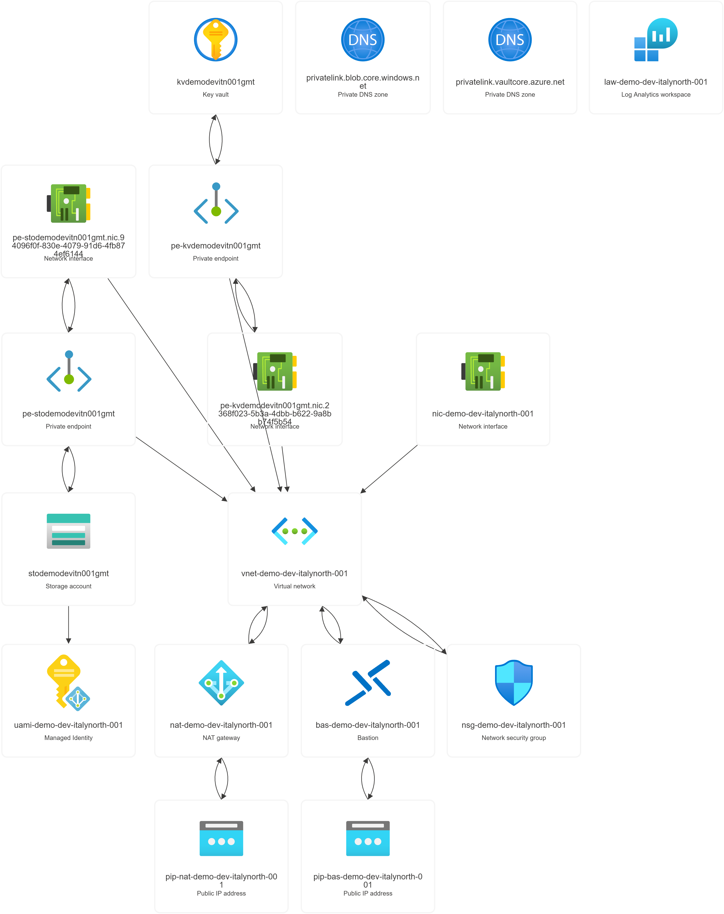

# Azure Verified Modules Terraform Lab

This repository builds a small, security-focused Azure environment with
[Azure Verified Modules (AVM)](https://azure.github.io/Azure-Verified-Modules/).
It is designed as a hands-on way to learn Terraform, Azure networking,
identity, private access, encryption, monitoring, and infrastructure lifecycle
management.

For the detailed theory behind every component, see
[README-THEORY.md](./README-THEORY.md).

## Why build this lab?

The goal is not only to deploy individual Azure resources. The goal is to see
how the resources cooperate in a realistic private workload:

- Terraform describes and tracks the complete environment as code.
- A Linux VM has no public IP and is reached securely through Azure Bastion.
- The VM uses a managed identity instead of stored Azure credentials.
- Key Vault and Blob Storage are reachable through private endpoints and
  private DNS.
- Storage encryption uses a customer-managed key from Key Vault.
- VM outbound traffic uses a NAT Gateway with a stable public IP.
- Diagnostic settings send supported platform logs and metrics to Log
  Analytics.

This architecture demonstrates the same building blocks commonly used for
private application servers, internal tools, regulated workloads, and secure
cloud landing zones.

The repository is deployed as one Terraform root module. All `.tf` files are
loaded together, Terraform builds a dependency graph, and one plan/apply cycle
creates the complete environment. The separate files organize the code by
Azure service; they are not separate deployment stages and are not executed in
filename order.

## Architecture



The image is an Azure Resource Visualizer snapshot. Some child and data-plane
objects, such as the Blob container, Key Vault keys, role assignments, and
diagnostic settings, are not always displayed as separate nodes.

The main traffic paths are:

```text
Administrator -> Azure Portal -> Bastion -> VM private IP
VM -> NAT Gateway -> Internet
VM -> Private DNS -> Private Endpoint -> Blob Storage
Storage Account -> Managed Identity -> Key Vault customer-managed key
Azure resources -> Diagnostic Settings -> Log Analytics
```

## What is created in the single deployment?

| Area | Resources | Purpose |
| --- | --- | --- |
| Foundation | Resource Group, Log Analytics Workspace | Resource organization and centralized monitoring |
| Networking | VNet, three subnets, NSG, NAT Gateway, public IP | Private addressing, traffic control, and outbound connectivity |
| Secrets and encryption | Key Vault, customer-managed key, Private Endpoint, Private DNS Zone | Private secret storage and encryption-key access |
| Data | Storage Account, private Blob container, user-assigned identity, Private Endpoint, Private DNS Zone | Private storage encrypted with the Key Vault key |
| Compute and administration | Linux VM, NIC, system-assigned identity, Bastion, Bastion public IP | Secure administration without a VM public IP |

The VNet uses `10.0.0.0/22` and contains:

| Subnet | CIDR | Use |
| --- | --- | --- |
| `virtual_machines` | `10.0.0.0/24` | VM network interface and NAT Gateway association |
| `AzureBastionSubnet` | `10.0.1.0/26` | Dedicated Azure Bastion subnet |
| `private_endpoints` | `10.0.1.64/28` | Key Vault and Storage private endpoints |

## Important security decisions

- The VM has no public IP.
- Bastion is the administrative entry point.
- Blob Storage is accessed with Microsoft Entra tokens, not storage keys.
- The VM identity receives `Storage Blob Data Contributor` only on the private
  `demo` container.
- A user-assigned identity receives `Key Vault Crypto Service Encryption User`
  so Storage can use the customer-managed key.
- The deployment identity receives `Key Vault Administrator` for lab key and
  secret operations.
- Private DNS maps normal Azure service names to private endpoint addresses.
- The Key Vault firewall allows the Terraform runner's detected public CIDR so
  Terraform can create keys and secrets during deployment.

## How the Terraform code works

Terraform loads every `.tf` file in this directory as one root module. Splitting
the configuration into files such as `avm.virtual_network.tf` and
`avm.storage_account.tf` makes it easier to read, but does not create separate
deployments.

The configuration follows this value flow:

```text
variables.tf -> terraform.tfvars -> locals.tf -> AVM modules -> outputs.tf
```

- `terraform.tf` pins Terraform and provider versions and configures AzureRM.
- `variables.tf` defines the input contract, types, defaults, and validation.
- `terraform.tfvars` supplies the values for this lab, including the Azure
  region, VNet CIDR, subnet sizes, VM image, VM size, and tags.
- `data.tf` reads the current Azure identity, runner public IP, and AVM region
  metadata without creating workload resources.
- `locals.tf` calculates consistent resource names, subnet CIDRs, associations,
  diagnostic settings, and the Key Vault firewall CIDR.
- `main.tf` creates the Resource Group and the random suffix required by
  globally unique Azure resource names.
- The `avm.*.tf` files call Azure Verified Modules for networking, Key Vault,
  Storage, identity, the VM, and Bastion.
- `outputs.tf` exposes useful names, resource IDs, and calculated subnet data
  after deployment.

Most deployment ordering is expressed through normal Terraform references. For
example:

```hcl
subnet_resource_id = module.virtual_network.subnets["private_endpoints"].resource_id
```

This reference tells Terraform that the subnet must exist before the private
endpoint can be created. The same pattern connects the VM NIC to its subnet,
the Storage Account to its Key Vault key and managed identity, diagnostic
settings to Log Analytics, and Bastion to its subnet and public IP. Terraform
uses these references to build the dependency graph for the single apply.

AVM modules are reusable, tested wrappers around Azure resources. The root
configuration supplies the lab-specific values, while the modules implement
the underlying resources, associations, telemetry, and optional diagnostic
settings.

## Prerequisites

- An Azure subscription with permission to create the resources and role
  assignments in this lab.
- [Azure CLI](https://learn.microsoft.com/cli/azure/install-azure-cli).
- [Terraform](https://developer.hashicorp.com/terraform/install) `~> 1.10`.
- An authenticated Azure CLI session.

Sign in and confirm the active subscription:

```powershell
az login
az account show --output table
```

If required, select the correct subscription:

```powershell
az account set --subscription "<subscription-id>"
```

## Deploy

This is a single deployment. The following plan contains the whole
architecture, and the following apply creates every required resource in the
order calculated from Terraform's dependency graph.

Run all Terraform commands from this repository directory:

```powershell
cd "D:\iskagkos\OneDrive - iΚnowΗealth\Desktop\Az-lab\avm-lab"
```

Format, initialize, and validate the configuration:

```powershell
terraform fmt -check
terraform init -input=false
terraform validate
```

Create a saved execution plan:

```powershell
terraform plan -out=tfplan
```

Review the summary carefully. In particular, confirm that Terraform is not
planning an unexpected destroy or replacement. Apply the exact saved plan:

```powershell
terraform apply "tfplan"
```

Do not reuse an old plan after changing configuration or after a partial apply.
Create a new plan instead.

## Verify the deployment

Inspect Terraform's outputs and managed resources:

```powershell
terraform output
terraform state list
```

The strongest Terraform consistency check is a second plan:

```powershell
terraform plan -detailed-exitcode
$LASTEXITCODE
```

The exit codes are:

- `0`: no changes; Azure and the Terraform configuration agree.
- `2`: Terraform detected pending changes or drift.
- `1`: Terraform returned an error.

List the live resources in the lab Resource Group:

```powershell
az resource list `
  --resource-group rg-demo-dev-italynorth-001 `
  --query "[].{Name:name,Type:type,Location:location}" `
  --output table
```

## Connect to the VM through Bastion

In the Azure Portal, open:

```text
Virtual Machines
-> vm-demo-dev-italynorth-001
-> Connect
-> Bastion
```

Use:

```text
Protocol: SSH
Port: 22
Authentication type: SSH Private Key from Azure Key Vault
Username: azureuser
Key Vault: kvdemodevitn001gmt
Secret: vm-demo-dev-italynorth-001-azureuser-ssh-private-key
```

The VM private IP is selected automatically when connecting from the VM page.
The VM intentionally has no public IP.

From the VM, useful end-to-end tests include:

```bash
nslookup kvdemodevitn001gmt.vault.azure.net
nslookup stodemodevitn001gmt.blob.core.windows.net
curl https://api.ipify.org
```

The two DNS lookups should resolve through the private DNS zones to private
endpoint IPs. The `curl` result should match the NAT Gateway public IP.

If Azure CLI is installed on the VM, test its managed identity and Blob RBAC:

```bash
az login --identity
az storage blob list \
  --account-name stodemodevitn001gmt \
  --container-name demo \
  --auth-mode login \
  --output table
```

An empty Blob list is still a successful authorization test when the container
does not contain any files.

## Common recovery cases

### A Diagnostic Setting already exists

Manual deletion and recreation of an Azure resource can leave its Diagnostic
Setting outside the current Terraform state. Import the existing setting into
the exact module address instead of attempting to create a duplicate.

### A VM SKU is unavailable

Azure capacity varies by region, subscription, and availability zone. Select a
currently available compatible SKU in `terraform.tfvars`, create a new plan,
and apply that new plan. This lab currently uses `Standard_D2als_v7` in
`italynorth`.

### Key Vault returns `ForbiddenByFirewall`

Confirm that the current runner IP is represented in the Key Vault firewall
rules, then create a fresh plan. RBAC permission and network permission are
separate checks; both must succeed.

## AVM telemetry

AVM modules enable anonymous module-usage telemetry by default. Resources such
as `random_uuid` and `modtm_telemetry` are Terraform/provider bookkeeping, not
billable workload resources in the Resource Group. Telemetry can be disabled
per module with:

```hcl
enable_telemetry = false
```

## Cost and cleanup

Azure Bastion, the VM, NAT Gateway, public IPs, Log Analytics ingestion, and
Storage can generate charges. When the lab is no longer needed, first create
and review a destroy plan:

```powershell
terraform plan -destroy -out=destroy.tfplan
terraform apply "destroy.tfplan"
```

Do not delete individual resources manually while keeping the Terraform state.
That creates drift and can leave extension resources, such as Diagnostic
Settings, behind. Key Vault purge protection can also keep the vault in a
soft-deleted state after cleanup.

## Repository guide

- `main.tf`, `locals.tf`, `variables.tf`, `terraform.tfvars`: root configuration,
  naming, inputs, and lab values.
- `avm.*.tf`: one focused AVM composition file per Azure service.
- `data.tf`: current Azure identity, runner public IP, and region metadata.
- `outputs.tf`: resource names, IDs, and calculated subnets.
- `README-THEORY.md`: detailed Terraform and Azure theory for the architecture.
- `architecture-diagram.mmd`: editable source for the detailed Mermaid diagram.
